# Architecture

## System architecture

The Communications Service is an independent microservice within the **Astro Merge**
platform. Internally it follows a **layered architecture** (controller → service →
repository) and exposes **two clearly differentiated entry channels**:

- **WebSocket (STOMP):** real-time **client↔server** channel for exchanging messages.
- **REST API:** management operations (history, moderation) and **communication with other microservices**.


## Architecture decisions

### Why WebSocket?

- **Real time without *polling*.** Chat requires immediate message delivery. With REST, the
  client would have to *poll* the server repeatedly, increasing latency and
  load. WebSocket keeps a persistent bidirectional connection and **pushes** messages
  to subscribed clients as soon as they occur.
- **STOMP over WebSocket** provides a **publish/subscribe** model with destinations and
  *topics*, which allows naturally modeling **one *topic* per conversation** (group chat,
  support conversation, direct messaging) and delivering each message only to the subscribers
  of that conversation.
- **Bounded scope:** WebSocket is **exclusively** the client↔server channel. Communication
  between microservices does **not** use WebSocket (see below).

### Why PostgreSQL and not NoSQL?

- **Referential integrity.** The domain has clear relationships: a **Message** belongs to
  a **Conversation**, and a **Report** references a **Message**. PostgreSQL's foreign keys
  and constraints guarantee this integrity natively.
- **Volume that does not justify NoSQL.** The system's messaging write volume does not
  reach the scale at which a NoSQL database would provide decisive advantages; the simplicity
  and transactional guarantees of a relational engine weigh more.
- **Relational queries.** Paginating a conversation's history, filtering reports by
  status, or joining messages with their reports is expressed directly in SQL.

### Inter-service communication: API / events

Communication with sibling microservices — `cc-users-players-service`, `cc-teams-service`, and
`am-notification-service` — happens exclusively over **REST via Spring Cloud OpenFeign**
declarative clients, never over the WebSocket channel. Each client has its own base URL
(`integrations.*.base-url`, see [Configuration](configuracion.md)) and its own Feign timeout
profile (`feign.client.config`), since a chat-completion call to the Groq-backed chatbot takes
noticeably longer than a plain existence check against users/teams.

Existence checks (user/team) can be toggled independently per environment
(`USER_EXISTENCE_CHECK` / `TEAM_EXISTENCE_CHECK`), so this service is never hard-blocked by a
sibling service that hasn't shipped its endpoint yet — both currently default to enabled, since
both real endpoints exist. There is no standalone audit service in the organization; support-ticket
transitions are logged locally instead of pushed to one. The full contract — JWT claim
compatibility and what each team exposes — is tracked in
[Service Integration](integracion-servicios.md).

## Design patterns

- **Layered architecture** (`controller` → `service` → `repository`): each layer only talks to
  the one directly below it; controllers never touch repositories directly.
- **DTO + Mapper** (MapStruct): entities never cross the API boundary directly. Mappers in
  `mapper/` translate between JPA entities and the DTOs exposed by REST/WebSocket controllers,
  keeping persistence details out of the public contract.
- **Repository pattern** (Spring Data JPA): data access is expressed through repository
  interfaces in `repository/`, with query derivation/JPQL instead of hand-written SQL.
- **Centralized exception handling**: cross-cutting error handling lives in `exception/`
  (`@RestControllerAdvice`-style translation of domain/validation errors into consistent HTTP
  responses), instead of try/catch blocks scattered across controllers.
- **Rich domain entities**: entities enforce their own invariants through behavior methods
  (see the [class diagram](#class-diagram)) rather than exposing plain setters, so state changes
  stay consistent with the domain rules.
- **Builder** (`SupportPromptBuilder`, `domain/service/support/`): assembles the prompt sent to
  the chatbot with a small fluent API — `.withSubject(...)`, `.withHistory(...)`, `.build()` — so
  `ChatbotSupportHandler` doesn't hand-concatenate strings. `build()` starts from `"Ticket
  subject: <subject>"` and, if there's prior conversation, appends a `"Conversation so far:"`
  block with one line per message, labeled `Assistant`/`User` by comparing the sender id against
  `SupportBotIdentity.BOT_USER_ID`. The last 10 messages of the ticket (`HISTORY_LIMIT`) are fed
  in, and the resulting string is what actually gets sent to Groq via `ChatbotClient.generateReply`.
  Keeping this in a builder means the prompt format can change in one place without touching the
  handler's control flow.
- **Chain of Responsibility** (support ticket escalation, `domain/service/support/`): each support
  level is a handler that either resolves the ticket or passes it to the next level. The chain,
  wired in `infrastructure/config/SupportChainConfig`, follows the order defined by `SupportLevel`
  — `FAQ → CHATBOT → MODERATOR → ORGANIZER → PENDING`:
    1. **`FaqSupportHandler`** (FAQ) — looks up a matching `Faq` by keyword and posts its answer;
       stays open at this level so the user can escalate manually if it didn't help.
    2. **`ChatbotSupportHandler`** (CHATBOT) — builds a prompt with `SupportPromptBuilder`, calls
       the Groq-backed chatbot, and always escalates to MODERATOR afterwards (with a fallback
       message if the AI call fails).
    3. **`ModeratorSupportHandler`** (MODERATOR) — human tier; escalates straight to ORGANIZER.
    4. **`OrganizerSupportHandler`** (ORGANIZER) — last human level; marks the ticket as pending
       once handled.

    `AbstractSupportHandler` implements the shared chain-walking logic (`canHandle` / delegate to
    `next`), so each concrete handler only implements `level()` and `doHandle()`.
    `SupportChainOrchestrator` holds the chain's head bean (`supportChainHead`) and is the only
    entry point application services use to run or resume the chain — extending it later is, per
    the config class's own javadoc, "a matter of inserting another handler in this single place."

## Components

```text
communications/
├── config/       # WebSocket/STOMP configuration, CORS, beans
├── controller/   # REST and WebSocket (STOMP) controllers
├── dto/          # Data transfer objects
├── entity/       # JPA entities (Conversacion, Mensaje, Reporte)
├── exception/    # Exceptions and centralized error handling
├── mapper/       # Entity <-> DTO conversion
├── repository/   # Data access (Spring Data JPA)
└── service/      # Business logic and integration with other services
```

## General flow

End-to-end path of a direct/group message:

1. The client opens a **STOMP over WebSocket** connection carrying its JWT.
2. A JWT filter validates the token and resolves the caller's identity (see
   [Service Integration](integracion-servicios.md#jwt-compatibility) for the exact claim
   resolution rules).
3. The client subscribes to the conversation's *topic* (`/topic/conversacion/{id}`).
4. The corresponding **service** validates the request (e.g. team membership via
   `cc-teams-service` when `TEAM_EXISTENCE_CHECK` is enabled) and persists the message through
   the **repository** layer.
5. The message is broadcast in real time to every client subscribed to that *topic*.
6. Moderation follows the same pattern for reported messages: a **Report** is created, reviewed
   by a moderator, and its resolution is persisted.

`am-notification-service` is only called from the [support chain](#design-patterns) today — when a
support ticket changes level, not for every regular chat message.

## UML and architecture diagrams

### Class diagram

Domain entities of the service (chat, messaging, moderation, support tickets and the FAQ
knowledge base) with their invariant-enforcing methods — mutation happens through these
methods, never through setters.

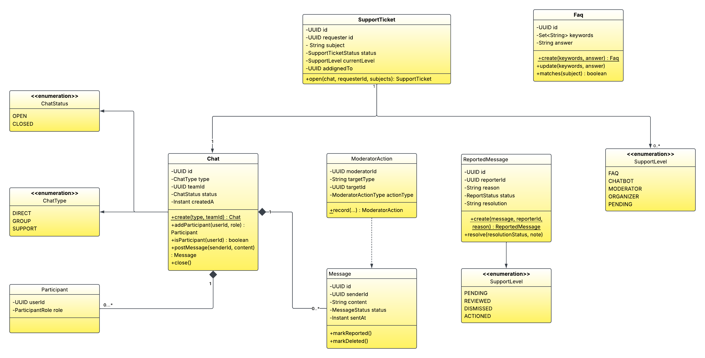

### Controller class diagram

The eight adapters in `infrastructure/in/rest/controller` are the service's inbound edge. Six are
REST controllers (`@RestController`, each implementing its `*ControllerSwagger` contract) and two
are STOMP/WebSocket controllers (`@Controller`). None of them touch repositories or domain logic
directly: they depend only on **inbound use-case ports** (`domain/service/ports/in`) and on
MapStruct mappers to translate between DTOs and domain models, honouring the layered architecture
described above.

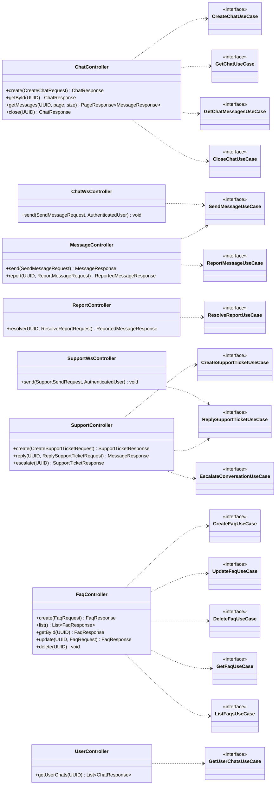

### Component diagram

Runtime view of how the inbound adapters, the application/domain core, the outbound ports and the
sibling services fit together. Everything in the core talks to the outside world only through
ports: repositories (Spring Data JPA), the `MessagePublisher` that pushes to STOMP topics, and the
Feign clients that reach the sibling microservices and the Groq-backed chatbot.

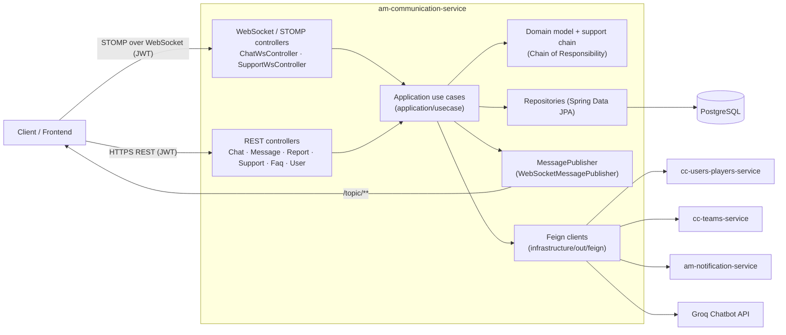

### Controller sequence diagrams

The following diagrams trace the end-to-end flow of each controller endpoint, from the inbound
adapter through the use-case port down to the domain, persistence and (where relevant) the sibling
services. `JwtAuthenticationFilter` / `WsAuthChannelInterceptor` have already resolved the caller
into an `AuthenticatedUser` before any handler below runs.

#### ChatController — create a chat (`POST /chats`)

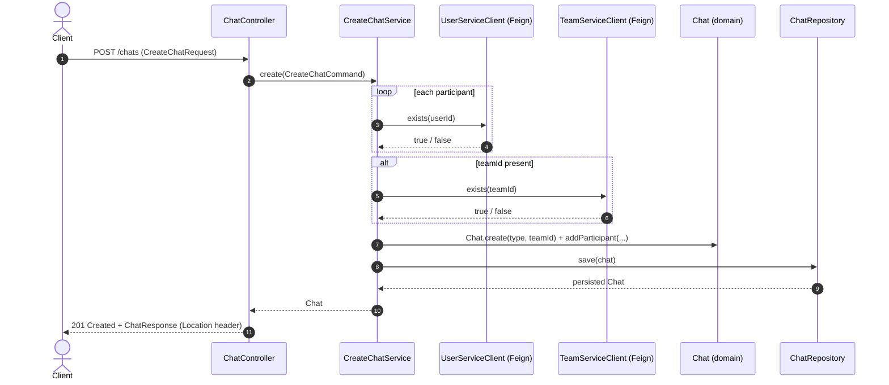

#### ChatController — read chat, history and close

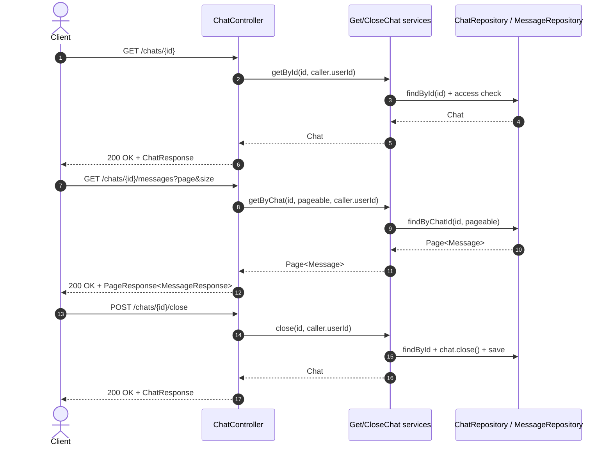

#### MessageController / ChatWsController — send a message

Both the REST endpoint and the STOMP endpoint funnel into the same `SendMessageUseCase`. The
WebSocket path additionally records a metric and a trace span; the domain enforces that the chat is
open and the sender participates, and the message is **persisted before** it is published to the
topic.

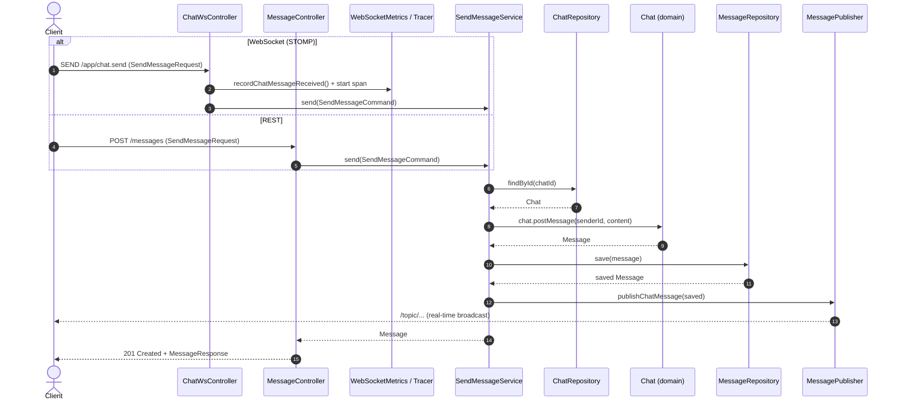

#### MessageController — report a message (`POST /messages/{id}/report`)

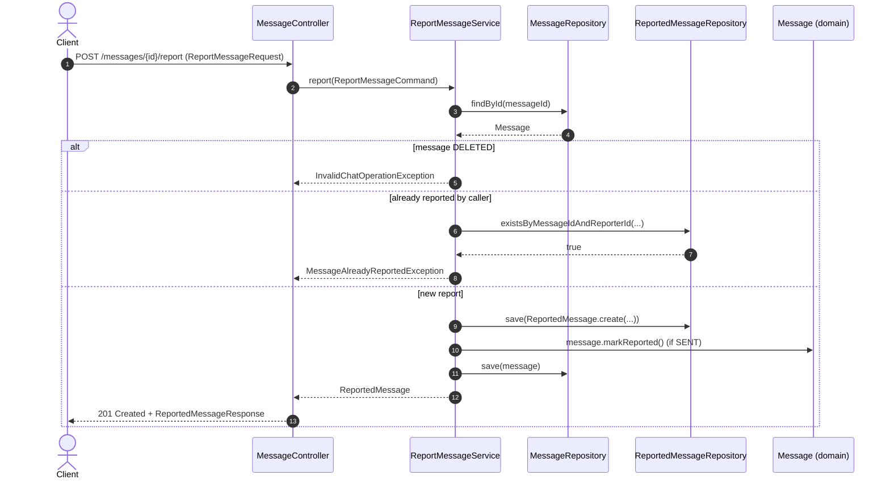

#### ReportController — resolve a report (`POST /reports/{id}/resolve`)

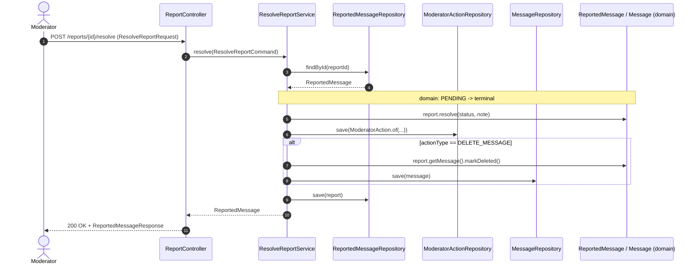

#### SupportController — create a ticket & run the automated chain (`POST /support/tickets`)

Creating a ticket opens a `SUPPORT` chat (requester + support bot), persists the ticket and runs
the automated stage of the **Chain of Responsibility**. Each level transition is logged locally and
best-effort notified through `am-notification-service`; a notification failure never rolls back an
applied transition.

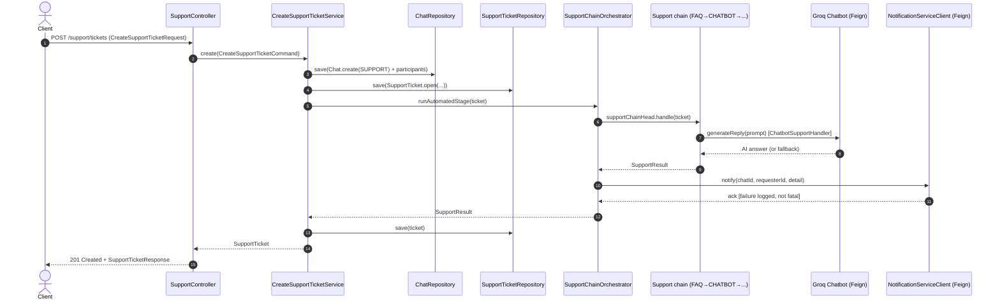

#### SupportController / SupportWsController — reply and escalate

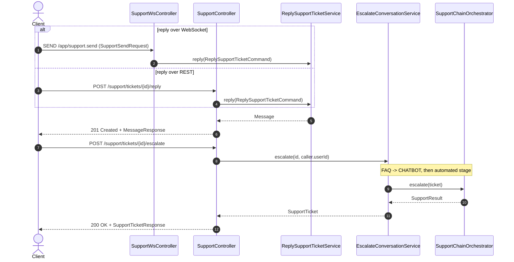

#### FaqController — FAQ knowledge-base CRUD

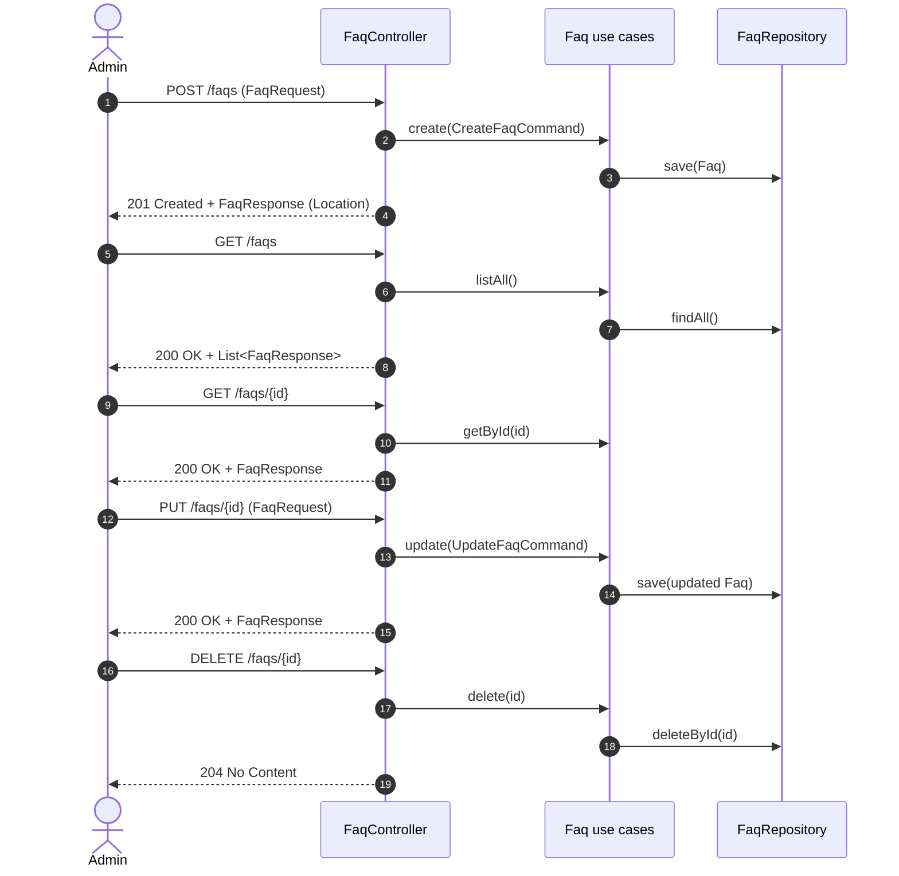

#### UserController — list a user's chats (`GET /users/{id}/chats`)

The caller may list their own chats; `MODERATOR`, `ORGANIZER` and `ADMIN` may look up anyone's,
which the controller enforces before delegating.

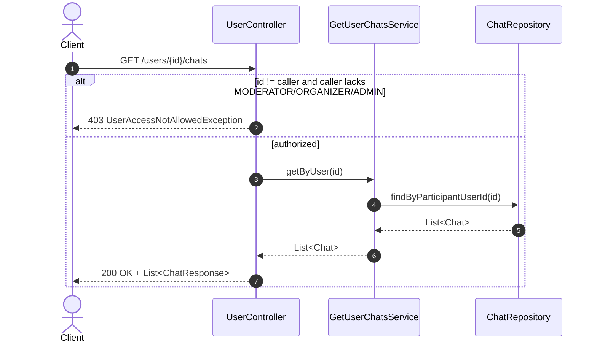
